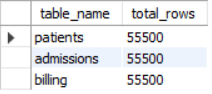
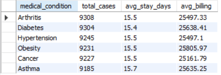
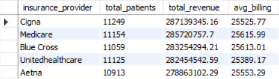
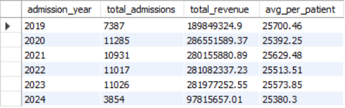
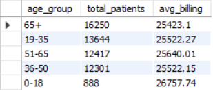
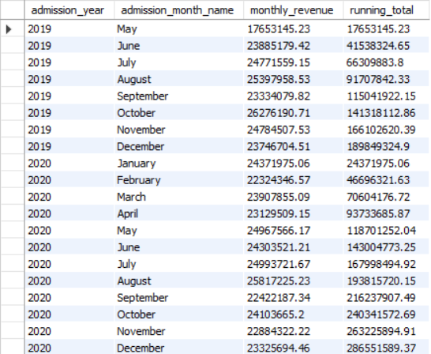
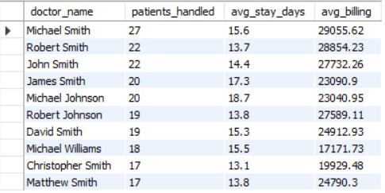
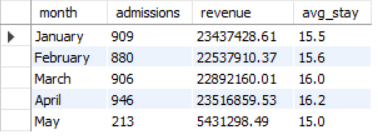

# 🏥 Hospital Operations & Patient Analytics using SQL


---

## 📌 Project Overview

A mid-sized hospital generates thousands of records daily — patient admissions,
doctor assignments, and billing transactions. Without structured analysis,
critical operational inefficiencies go unnoticed and revenue opportunities are missed.

This project builds a **3-table relational database from scratch**, loads **55,500
real patient records**, and answers **10+ real business questions** using advanced
SQL — helping hospital management make data-driven decisions on revenue,
staffing, and patient care.

---

## 🎯 Business Problems Solved

| # | Business Question | SQL Technique Used |
|---|---|---|
| 1 | Which medical condition has the highest patient volume? | GROUP BY + aggregation |
| 2 | Which insurance provider generates the most revenue? | JOIN + SUM |
| 3 | How is revenue trending year over year? | GROUP BY + ORDER BY |
| 4 | Which age group has the most admissions? | JOIN + GROUP BY |
| 5 | What is the running total revenue month by month? | CTE + SUM() OVER() |
| 6 | Which doctors handle the most patients? | JOIN + GROUP BY + LIMIT |
| 7 | How do admissions change month over month? | LAG() window function |
| 8 | Which admission type generates most revenue? | JOIN + GROUP BY |
| 9 | What is the monthly performance report for any year? | Stored Procedure |

---

## 📊 Key Insights Found

- 🦴 **Arthritis** is the most prevalent condition with **9,308 cases** and average billing of **$25,497 per patient**
- 💰 **Cigna** is the top revenue-generating insurance provider at **$287M** across **11,249 patients**
- 📅 **April 2024** was the peak admission month with **946 admissions** generating **$23.5M** in revenue
- 📈 Average patient billing is consistent across all conditions at **~$25,500**, indicating stable pricing
- 👨‍⚕️ Top doctors each handle similar patient volumes, suggesting balanced workload distribution
- 🏥 **Urgent, Elective and Emergency** admissions are evenly split across the dataset

---

## 🗄️ Database Schema

```
patients ──< admissions
patients ──< billing
admissions ──< billing
```

**3 Tables | 55,500 Records | 10+ Business Queries**

| Table | Description | Rows |
|---|---|---|
| patients | Demographics — name, age, gender, blood type | 55,500 |
| admissions | Clinical — condition, doctor, stay duration, dates | 55,500 |
| billing | Financial — insurance, billing amount, payment mode | 55,500 |

---

## 🛠️ Tools & Technologies

| Tool | Purpose |
|---|---|
| MySQL 8.0 | Database creation and querying |
| MySQL Workbench | Query execution and visualization |
| Python 3.12 | Data cleaning and loading |
| Pandas | Data manipulation and preprocessing |
| SQLAlchemy + PyMySQL | Python to MySQL connection |

---

## 📁 Project Structure

```
hospital-sql-analysis/
├── data/
│   └── raw/                     ← Original CSV (not committed to GitHub)
├── sql/
│   └── analysis.sql      ← All business analysis queries
├── python/
│   └── clean_and_load.py         ← Data cleaning + MySQL loading script
├── screenshots/                  ← Query output screenshots
│   ├── 01_table_verification.png
│   ├── 02_medical_conditions.png
│   ├── 03_insurance_revenue.png
│   ├── 04_yearly_revenue.png
│   ├── 05_age_group_analysis.png
│   ├── 06_running_total.png
│   ├── 07_top_doctors.png
│   └── 08_stored_procedure.png
├── .env                ← Environment variable template
├── .gitignore                    ← Ignores .env and raw data
├── insights_report.md            ← Written business findings
└── README.md
```

---

## 🚀 How to Run This Project

### Step 1 — Download the Dataset
- Go to [Kaggle — Healthcare Dataset](https://www.kaggle.com/datasets/prasad22/healthcare-dataset)
- Download and place `healthcare_dataset.csv` in `data/raw/`

### Step 2 — Set Up Environment Variables
```bash
cp .env.example  ← Environment variable 
# Edit .env and fill in your MySQL credentials
```

### Step 3 — Install Dependencies
```bash
pip install pandas sqlalchemy pymysql python-dotenv
```

### Step 4 — Create Database in MySQL Workbench
```sql
CREATE DATABASE IF NOT EXISTS hospital_analytics;
```

### Step 5 — Run the Cleaning and Loading Script
```bash
cd python
python clean_and_load.py
```

This will clean all 55,500 records, create 3 relational tables, and load everything into MySQL automatically.

### Step 6 — Run the Analysis
Open `sql/analysis_queries.sql` in MySQL Workbench and run queries section by section.

---

## 📸 Query Output Screenshots

| Query | Result |
|---|---|
| Table Verification |  |
| Medical Conditions |  |
| Insurance Revenue |  |
| Yearly Revenue |  |
| Age Group Analysis |  |
| Running Total |  |
| Top Doctors |  |
| Stored Procedure |  |

---

## 💡 Business Recommendations

**1. Focus on Cigna & Medicare Partnerships**
These two providers contribute over $572M in combined revenue. Strengthening these relationships through dedicated service agreements could stabilise hospital revenue significantly.

**2. April Resource Planning**
April consistently shows the highest admission volume. Pre-positioning additional staff and beds before April each year can reduce patient wait times during peak periods.

**3. Condition-Specific Care Packages**
With Arthritis, Diabetes, and Hypertension as the top 3 conditions, targeted care packages and preventive programmes for these conditions can reduce average length of stay and improve patient outcomes.

---

## 📄 Dataset Credit

- Healthcare Dataset — [Kaggle / prasad22](https://www.kaggle.com/datasets/prasad22/healthcare-dataset)
- 55,500 synthetic patient records covering admissions, billing, and demographics

---

## 👤 Author

**Kiran U** — Aspiring Data Analyst | BCA Graduate | PGP Data Science (GenAI)

- 📧 kirankiranu791@gmail.com
- 💼 [LinkedIn](https://www.linkedin.com/in/kiran-u-471818325/)
- 🐙 [GitHub](https://github.com/KIRAN4003)
