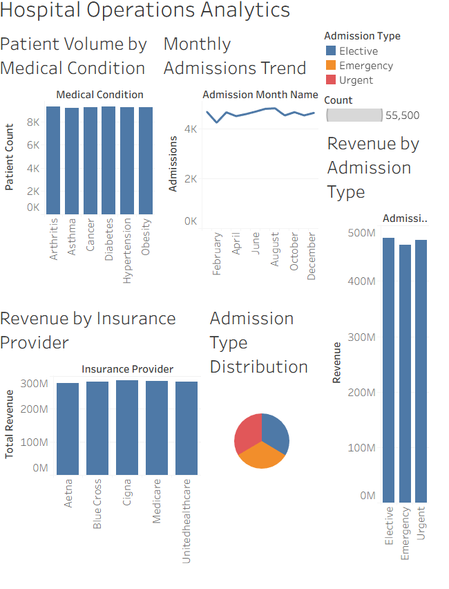
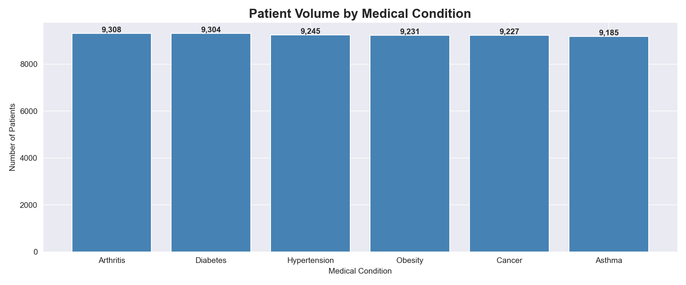
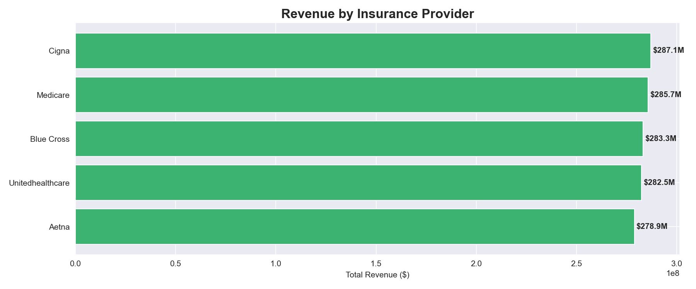
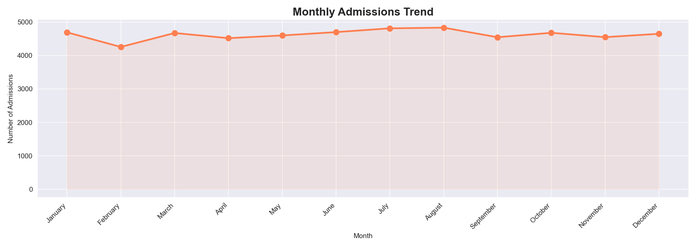
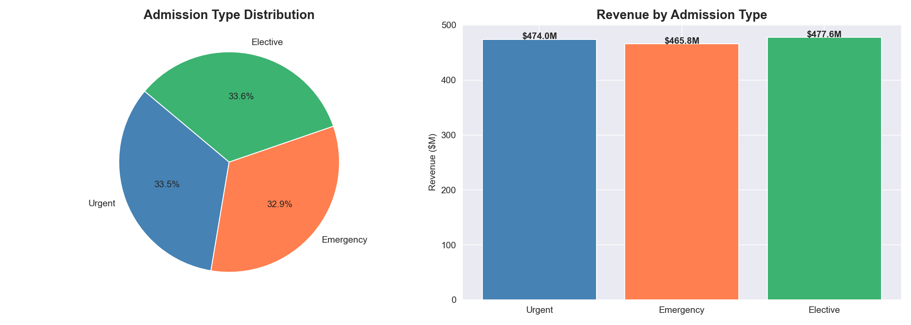

# 🏥 Hospital Operations & Patient Analytics

> **A end-to-end Data Analytics project analyzing 55,500 patient records
> using MySQL, Python and Tableau to uncover operational insights,
> revenue patterns and staffing efficiency.**

---
## 📊 Tableau Dashboard
🔗 [View Interactive Dashboard](your tableau public link)

## 📌 Project Overview


---

## 🎯 Business Problems Solved

| # | Business Question | SQL Technique |
|---|---|---|
| 1 | Which medical condition has highest patient volume? | GROUP BY + aggregation |
| 2 | Which insurance provider generates most revenue? | JOIN + SUM |
| 3 | How is revenue trending year over year? | GROUP BY + ORDER BY |
| 4 | Which age group has most admissions? | JOIN + GROUP BY |
| 5 | What is running total revenue month by month? | CTE + SUM() OVER() |
| 6 | Which doctors handle most patients? | JOIN + GROUP BY + LIMIT |
| 7 | How do admissions change month over month? | LAG() window function |
| 8 | Which admission type generates most revenue? | JOIN + GROUP BY |
| 9 | What is monthly performance report for any year? | Stored Procedure |

---

## 📊 Key Insights Found

- 🦴 **Arthritis** is most prevalent condition — 9,308 cases, avg billing $25,497
- 💰 **Cigna** is top revenue insurance provider — $287M across 11,249 patients
- 📅 **April 2024** was peak admission month — 946 admissions, $23.5M revenue
- 📈 Average patient billing consistent at **~$25,500** across all conditions
- 👨‍⚕️ Top doctors handle similar volumes — **balanced workload distribution**
- 🏥 Urgent, Elective and Emergency admissions **evenly split** across dataset

---

## 🗄️ Database Schema

```
patients ──< admissions
patients ──< billing
admissions ──< billing
```

| Table | Description | Rows |
|---|---|---|
| patients | Demographics — name, age, gender, blood type | 55,500 |
| admissions | Clinical — condition, doctor, stay duration | 55,500 |
| billing | Financial — insurance, billing amount, payment | 55,500 |

---

## 🛠️ Tools & Technologies

| Tool | Purpose |
|---|---|
| MySQL 8.0 | Database creation and querying |
| MySQL Workbench | Query execution and visualization |
| Python 3.12 | Data cleaning and loading |
| Pandas + Matplotlib + Seaborn | Data visualization |
| SQLAlchemy + PyMySQL | Python to MySQL connection |
| Tableau Public | Interactive dashboard |

---

## 📂 Project Structure

```
hospital-sql-analysis/
├── data/
│   └── raw/                      ← Original CSV (not committed)
├── sql/
│   └── analysis.sql              ← All business analysis queries
├── python/
│   ├── clean_and_load.py         ← Data cleaning + MySQL loading
│   └── visualizations.py         ← Python charts
├── screenshots/
│   ├── 01_table_verification.png
│   ├── 02_medical_conditions.png
│   ├── 03_insurance_revenue.png
│   ├── 04_yearly_revenue.png
│   ├── 05_age_group_analysis.png
│   ├── 06_running_total.png
│   ├── 07_top_doctors.png
│   ├── 08_stored_procedure.png
│   ├── tableau_dashboard.png
│   ├── viz_01_conditions.png
│   ├── viz_02_insurance.png
│   ├── viz_03_monthly_trend.png
│   └── viz_04_admission_type.png
├── .env.example
├── .gitignore
├── insights_report.md
└── README.md
```

---

## 📸 SQL Query Output Screenshots

| Query | Screenshot |
|---|---|
| Table Verification |  |
| Medical Conditions |  |
| Insurance Revenue |  |
| Yearly Revenue |  |
| Age Group Analysis |  |
| Running Total |  |
| Top Doctors |  |
| Stored Procedure |  |

---

## 📊 Python Visualizations

| Medical Conditions | Insurance Revenue |
|---|---|
|  |  |

| Monthly Admissions Trend | Admission Type Analysis |
|---|---|
|  |  |

---

## 📊 Tableau Dashboard


---
## 💡 Business Recommendations

**1. 🤝 Focus on Cigna & Medicare Partnerships**
> Combined revenue of $572M+ from these two providers.
> Strengthen relationships through dedicated service agreements
> to stabilise hospital revenue long term.

**2. 📅 April Resource Planning**
> April consistently shows highest admission volume — 946 admissions.
> Pre-position additional staff and beds before April each year
> to reduce patient wait times during peak periods.

**3. 🏥 Condition-Specific Care Packages**
> Arthritis, Diabetes and Hypertension = top 3 conditions.
> Targeted care packages for these conditions can reduce
> average length of stay and improve patient outcomes.

**4. 👨‍⚕️ Balanced Doctor Workload**
> Top doctors handle similar patient volumes — good distribution.
> Maintain this balance as hospital scales to avoid burnout.

---

## 📄 Dataset

- **Source:** Healthcare Dataset — Kaggle / prasad22
- **Records:** 55,500 synthetic patient records
- **Coverage:** Admissions, billing and demographics

> ⚠️ Raw data not included due to size.
> Download from Kaggle and run clean_and_load.py

---

## ⚙️ How To Reproduce

```bash
# Clone repo
git clone https://github.com/KIRAN4003/Hospital-sql-analysis.git

# Install dependencies
pip install pandas sqlalchemy pymysql python-dotenv matplotlib seaborn

# Set up .env file
cp .env.example .env

# Run cleaning script
python python/clean_and_load.py

# Run visualizations
python python/visualizations.py
```

---

## 👤 Author

**Kiran U**
Aspiring Data Analyst | BCA Graduate | PGP Data Science (GenAI)

- 📧 kirankiranu791@gmail.com
- 💼 [LinkedIn](https://www.linkedin.com/in/kiran-u-471818325/)
- 🐙 [GitHub](https://github.com/KIRAN4003)

---

⭐ **If you found this project helpful, please star the repository!**